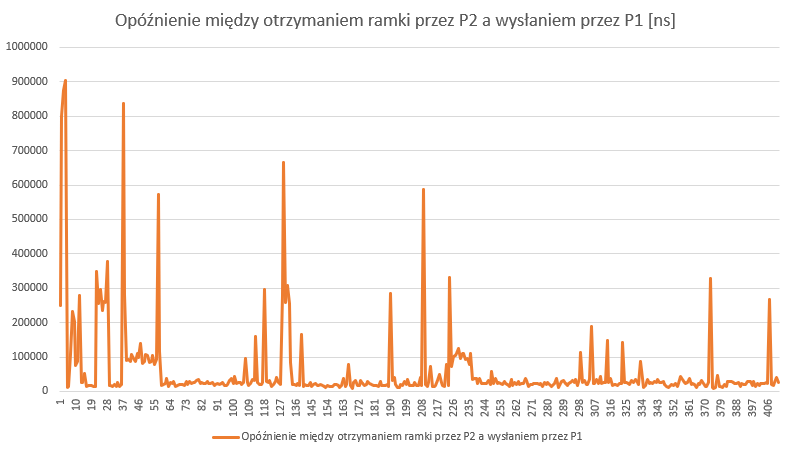
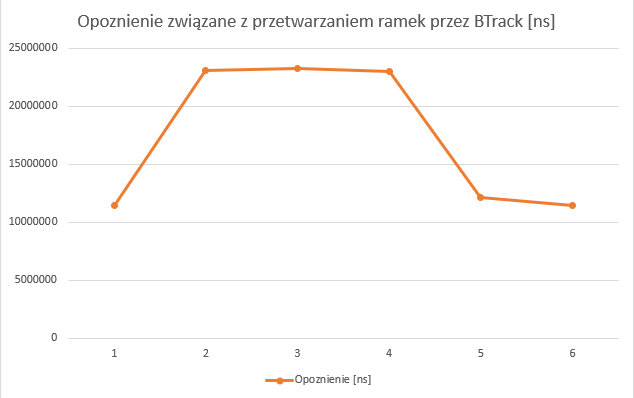
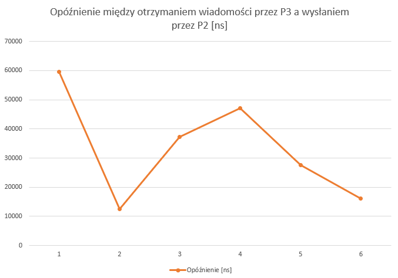

# SCZR Projekt

# Temat
System czasu rzeczywistego wizualizujący rytm muzyki na diodach LED działający na RPI.

Projekt realizowany w ramach przdmiotu SCZR (realizacja 20Z) przez zespół:
- Maciej Dmowski
- Jakub Strawa
- Adam Szałowski

# Opis projektu
Projekt jest systemem czasu rzeczywistego realizującym obsługę oraz anlizę plików audio. Poszczególne procesy działają zgodnie z diagramem oraz szczegółowym opisem poniżej. Projekt przy pomocy RPI odtwarza oraz analizuje na bieżąco plik audio, wyświetlając przy pomocy diód LED tempo (BPM). Techniczne szczegóły implementacji opisane są w dalszych sekcjach tego pliku.

# Link do repozytorium
https://gitlab-stud.elka.pw.edu.pl/jstrawa/projekt-sczr

# Diagram procesów


# Opis procesów

## Zarządca procesów
Odpowiada za odpowiednie uruchomienie i zamknięcie procesów oraz inicializację i terminację kolejek wiadomości. Dodatkowo, proces ten będzie zapisywał otrzymane komunikaty z logami na dysk w celu analizy skuteczności rozwiązania oraz jakości synchronizacji procesów. Zapis będzie się odbywał po zbuforowaniu określonej liczby logów. Liczba zostanie określona poprzez przetestowanie działania systemu.

## Proces 1
Ma za zadanie wczytać odpowiedni plik audio, odtworzyć go oraz przesłać pakiety danych do kolejnego procesu. Wczytanie i obsługa plików odbywać się będzie przez bibliotekę [miniaudio](https://github.com/mackron/miniaudio). 
1. Tworzy wirtualne urządzenie audio, które będzie odtwarzało dźwięk na domyślne wyjście audio urządzenia.
2. Wczytuje kolejne ramki odtwarzanego pliku i przekazuje je w postaci komunikatów do procesu 2.


## Proces 2
Ma za zadanie przeanalizować otrzymane dane aby wykryć rytm muzyki. Następnie proces przesła dane do kolejnego procesu. Analiza wykonywana jest przy pomocy biblioteki [BTrack](https://github.com/adamstark/BTrack).
1. Odbiera ramki pliku z kolejki komunikatów
2. Wyznacza rytm korzystając z szybkiej tranformaty Fouriera
3. Na podstawie wyliczenia ustala czy obecna ramka jest częścią rytmu i jeśli jest to przekazuje taką informację do procesu 3
4. Przekazuje do procesu 3 sygnał o tym czy wykryty został beat w przetwarzanej ramce

## Proces 3
Ma za zadanie wyświetlić otrzymane dane o rytmie na diodzie LED.

# Synchronizacja
Proces 2 i 3 oczekują na komunikaty od procesów 1 i 2. Procesy są zawieszane do czasu pojawienia się komunikatu.
Proces 1 jest głównym producentem danych. Zawieszenie następuje w momencie przepełnienia kolejki.
Synchronizacja nieblokująca między procesem zarządzającym a kolejkami logów.

# Komunikacja
Komunikacja między procesami odbywać się będzie za pomocą kolejek komunikatów.

1. message_queue_12
    Przesył buforu próbek dzwiękowych.
    Struktura wiadomości:
    ```c
        float frames[2048];
    ```
2. message_queue_23
    Przesył wykrytego rytmu.
    Struktura wiadomości:
    ```c
        struct msg_buf_23 {
            char msg;
        }
 
    ```
3. log_msg_queue_d1, log_msg_queue_d2, log_msg_queue_d3
    Przesył wiadomości o czasie otrzymania oraz wysłania wiadomości.
    Struktura wiadomości:
    ```c
        struct log_msg_buf{
            unsigned int msg_id;     
            struct timeval tv;
            enum MsgType {RECEIVED, SENT} type;    
        } 
    ```
    
# Podział obowiązków
#### Maciej Dmowski
* Utworzenie zarządcy procesów
* Utworzenie procesu 1
* Utworzenie kolejek wiadomości
* Wdrożenie mechanizmów synchronizacji
#### Jakub Strawa
* Utworzenie procesu 2
* Określenie sposobu przesyłania pakietów
* Utworzenie algorytmu określającego tempo utworu
* Utworzenie dokumentacji oraz analiza eksperymentów
#### Adam Szałowski
* Utworzenie procesu 3
* Konfiguracja RPI
* Przygotowanie i przesłanie odpowiednich sygnałów na diody
* Zaprojektowanie układu elektrycznego łączego diody z urządzeniem
* Utworzenie kolejek wiadomości


# Planowane eksprymenty
Początkowo zakładamy brak jakiejkolwiek ingerencji w sposób działania systemu. Pierwszym eksperymentem będzie zatem porównanie działania diody do rzeczywistego słyszalnego tempa. Zmierzone opóźnienia wykorzystamy do określenia jakości synchronizacji. Uzyskane w ten sposób dane porównamy z danymi uzyskanymi z logów otrzymywanych przez zarządcę procesów. Następnym krokiem będzie próba dostrojenia systemu (zmniejszenia opóźnień) poprzez dobór priorytetów dla procesów metodą eksperymentalną. Dla każdej takiej próby wykonany zostanie eksperyment mający na celu jakość dostrojenia. Jeśli zaś ta metoda. zawiedzie, kolejnym planowanym eksperymentem będzie przydzielenie każdemu procesowi własny rdzeń procesora. Następnie powtórzony zostanie eksperyment polegający na porównaniu działania diody do słyszalnego tempa.
Jeśli zaś zauważymy, że narzut czasowy związany z kopiowaniem danych do i z kolejki komunikatów będzie duży, przetestujemy przekazywanie danych przez pamięć współdzieloną.

# Przeprowadzone ekspermenty
Naszym pierwszym krokiem było zmierzenie i porównanie opóźnień między procesami, co wykonane zosatło przy użyciu dokładnych czasów podawanych do kolejek komunikatów wiadomości dla każdego procesu. Już na wczesnym etapie testowania zauważyliśmy, że program uruchomiony na RaspberryPi nie wykazuje znaczących opóźnień. Analiza opóźnień dla poszczególnych procesów przedstawiona jest na wykresie poniżej. 

### Wykresy







# Potencjalne usprawnienia
Zdecydowanie największym usprawnieniem byłoby wykorzystanie innej biblioteki niż BTrack, ponieważ pomimo dobrych założeń teoretycznych wykazuje ona często duże odchylenia od realnego tempa. Kolejnym usprawnieniem byłoby wykorzystanie mocniejszej płytki RaspberryPi oraz większej ilości diód, co pozwoliłoby nam wykonać bardziej czasochłonne obliczenia (np. wykorzystać inną bibliotekę: wolniejszą, ale dokładniejszą).

# Wnioski
Projekt okazał się być dla całego zespoły sporym wyzwaniem, ale każdy z nas z przekonaniem stwierdził, że realizacja tego projektu pozwoliła mu znacząco poszerzyć swoją wiedzę na temat działania oraz tworzenia systemów czasu rzeczywistego.

# Przemyślenia
#### Maciej Dmowski
Interesujące okazało się, żę biblioteka miniaudio nie jest w stanie wysyłać stałego rozmiaru ramek, ale jest on zależny od systemu. Jednocześnie autor w dokumentacji nie uwzględnił takiej możliwości. Z racji niedokładności wykrywania tempa dokonaliśmy licznych prób znalezienia przyczyny, jednak z braku specjalistycznej wiedzy, nie udało nam się usprawnić algorytmu.

#### Jakub Strawa
Uważam, że największym wyzwaniem dla mnie było przygotowanie biblioteki BTrack do użycia, ponieważ okazało się, że wymaga ona kilku innych zewnętrznych bibliotek, których proces instalacyjny był bardzo skomplikowany. Sytuacji nie ułatwiła szczątkowa dokumentacja biblioteki BTrack. Dobrym usprawnieniem byłoby użycie szybszej płytki oraz innej biblioteki, ponieważ BTrack wykazuje sporo niedokładności.

#### Adam Szałowski
Dużym wyzwaniem okazały się też ograniczenia sprzętowe płytki Raspberry Pi 0W. Ponieważ posiada ona tylko jeden rdzeń nie można było przypisywać poszczególnym procesom osobynych rdzeni i w ten sposób uchronić je przed "schedulerem". Jednocześnie komponenty, które wykorzystywaliśmy nie pozwalały nam zainstalować typowego systemu czasu rzeczywistego pozbawionego rdzenia linuxa. Dobrym usprawnieniem było by więc wykorzystanie płytki przeznaczonej wyłączenie do systemów czasu rzeczywistego i ewentualna komunikacją z taką płytką za pomocą raspberry.
